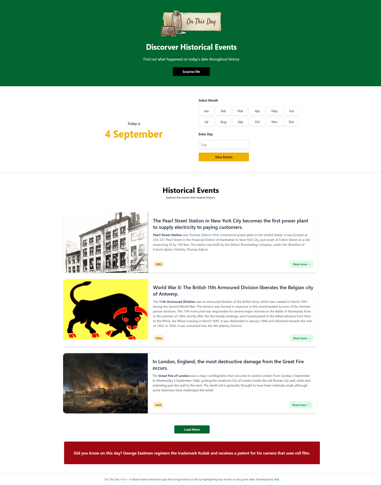

# On This Day v1.0 📅✨

Welcome to **On This Day**, a modern React-based interactive app that brings history to life by highlighting key events that happened on any given date.

Check it out live 👉 **[On This Day App](https://your-live-link.netlify.app/)**

---

## ✨ Features

- 📅 **Date-Based Discovery** – Explore major historical events by selecting any month and day.
- 🎲 **Surprise Me** – Instantly get a random historical event.
- 📰 **Detailed Event Cards** – Includes images, descriptions, years, and direct links to Wikipedia pages.
- 📖 **Load More Option** – Seamlessly browse more events without clutter.
- 🎨 **Clean UI/UX** – Minimalist design for an easy and engaging experience.
- 🌍 **Wikipedia API Integration** – Real-time event data fetched dynamically.
- ⚡ **Built with React + Vite** – Fast development and optimized performance.
- 🌐 **Hosted on Netlify** – Live preview available anywhere, anytime.

---

## 🛠 Tech Stack

- **React 19**
- **Tailwind CSS** (for styling)
- **Vite** (for development and build)
- **Wikipedia REST API** (`/api/rest_v1/feed/onthisday/all/{month}/{day}`)
- **Netlify** (for hosting)

---

## 📸 Screenshot



---

## 🚀 Getting Started

Want to check it out locally? Follow these steps:

### 📋 Requirements

- **Node.js** (v16 or later)
- **npm** (or yarn)

### ⏳ Installation

1. **Clone this repository**

   ```sh
   git clone https://github.com/your-username/on-this-day.git
   cd on-this-day
   ```

2. **Install dependencies**

   ```sh
   npm install
   ```

3. **Run the development server**

   ```sh
   npm run dev
   ```

4. Open your browser and go to `http://localhost:5173/` (or the provided URL).

### 📦 Build for Production

To create an optimized production build:

```sh
npm run build
```

To preview the production build locally:

```sh
npm run preview
```

---

## 🎨 About the Author

Created with ❤️ by **[Md Asifullah](https://www.artisanasif.com/)**, a passionate **Front-End Developer & Software Engineer**.

💼 Want to connect? Let’s talk! 🚀

---

## 📜 License

This project is for **learning and portfolio purposes** only.  
Feel free to fork, explore, and experiment!

**Happy Coding! 🎉**
